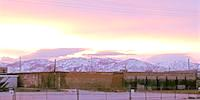
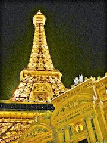
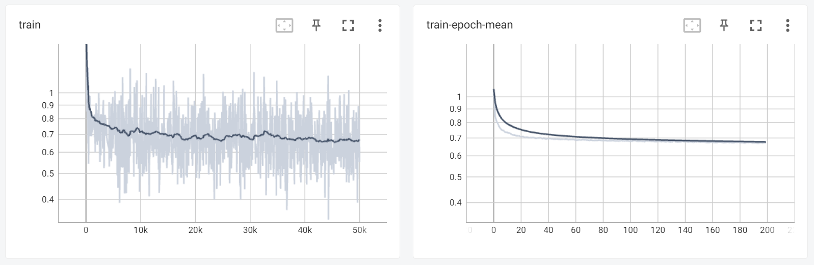
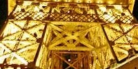

# Zero-DCE-improved

  - [Overview](#overview)
    - [Introduction](#introduction)
    - [Folder Structure](#folder-structure)
  - [Quick Start](#quick-start)
    - [Prerequisites](#prerequisites)
    - [Train](#train)
    - [Test](#test)
  - [Improvement](#improvement)
    - [Problem Analysis](#problem-analysis)
    - [Network Improvement](#network-improvement)
      - [Reduce Parameters](#reduce-parameters)
      - [Add Overlapping Pooling Layer](#add-overlapping-pooling-layer)
      - [Adjust Loss Function](#adjust-loss-function)
    - [Image Post-processing](#image-post-processing)
  - [Comparison of Results](#comparison-of-results)
    - [Enhancement Effect](#enhancement-effect)
      - [Improvement Effect](#improvement-effect)
      - [Overall Effect](#overall-effect)
    - [Model Size & Reasoning Speed](#model-size--reasoning-speed)

## Overview
### Introduction
This is the implementation of ***Zero-Reference Deep Curve Estimation for Low-Light Image Enhancement***, and the effect of this paper has reached the SOTA at that time. 

Based on the method proposed in the paper and the open source code provided by the author, we have improved the effect of image enhancement under low light through model improvement and combined with traditional techniques, while reducing the size of the model to a certain extent and speeding up training and reasoning.

### Folder Structure
    src
    ├── data
    │   ├── result              # enhanced results
    │   ├── test_data           # testing data
    │   │   ├── LIME 
    │   │   └── DICM
    │   └── train_data          # data for training
    ├── lowlight_test.py        # testing code
    ├── lowlight_train.py       # training code
    ├── model.py                # Zero-DEC network
    ├── Myloss.py               # loss function definition
    ├── dataloader.py           
    ├── runs                    # dir for storing training logs
    └── snapshots               # dir for storing the models
        └── pre-train.pth       # A pre-trained snapshot

## Quick Start
### Prerequisites
- Python 3.8
- CUDA 11.1

The pip package required to run the code is installed by executing the following command in the `src`: 
``` bash
python -m pip install -r requirements.txt
```

### Train
You can change the training data by modifying the pictures stored in `src/data/train_data`. 

Execute the following command to start training:
``` bash
python lowlight_train.py 
```

During the training process, you can execute the following commands to view the training progress and results in real time through tensorboard:
``` bash
tensorboard --logdir=runs 
```

### Test
You can change the test data by modifying the pictures stored in `src/data/test_data`. The enhanced results are saved in `src/data/result`.

Execute the following command to start testing:
``` bash
python lowlight_test.py 
```

## Improvement
### Problem Analysis
Before starting to improve the original paper, we first reproduced its effect, and through the analysis of the enhanced picture, we summarized the following issues that need to be improved:
- **Higher Brightness**: Some pictures with large areas of bright parts show **higher brightness** in bright parts after enhancement, and the original bright parts are too bright.
- **Noise**: In some pictures with large dark areas, a lot of **noise** appears in the dark areas after enhancement.
- **Loss of Details**: After the enhancement, the details of some pictures are obviously lost.

||Noise|Loss of Details|Higher Brightness|
|:-:|:-:|:-:|:-:|
|Original||||
|Enhanced||||

### Network Improvement
At present, low-light image enhancement technologies are widely used in the fields of mobile phone photography and video enhancement, and they have relatively high requirements for the enhancement speed and the size of the model. Therefore, in addition to improving the effect of enhancement, we also need to reduce the size of the trained model as much as possible and increase the enhancement speed.

#### Reduce Parameters
The size of the model and the speed of training and calculation almost depend on the amount of parameters and calculations in the network design. By reducing the size and the number of channels of the input image of each layer, the model can be effectively reduced and the speed can be increased. However, this paper designs an image-specific curve. Through repeated application of itself, a pixel-wise and higher-order curve can be fitted to complete the effective mapping from low-light pixel color to normal-light pixel color. Therefore, when performing feature extraction, if we choose to compress the size of the input image, the color information of many pixels will be lost. When the image size is restored by subsequent upsampling or deconvolution, the content details of the image will be lost or a lot of noise and white border will appear (As shown below). Therefore, in the part of reducing network parameters, we have chosen to reduce the number of input channels. The size of the model is compressed from the original 316KB to 97KB. A certain improvement has also been made in training speed and enhancement speed.


|White Border|Lots of Noise|
|:-:|:-:|
|||

#### Add Overlapping Pooling Layer
Generally speaking, we can use the pooling layer or subsampling layer to perform feature selection, reduce the number of features, and thereby reduce the number of parameters, thereby reducing the size of the model and increasing the speed. But as we have mentioned earlier, reducing the input image size is not a method worth considering in this method, so we use the maximum overlap pooling with a convolution kernel of 3 and a step size of 1 added after the third convolutional layer. (In the test, we found that too many pooling layers will cause problems such as loss of image details and increased noise). The addition of the maximum overlap pooling layer can improve the prediction accuracy and alleviate overfitting.

#### Adjust Loss Function
This paper sets a series of non-reference loss functions (spatial consistency loss, exposure control loss, color constancy loss, illumination smoothness loss), so that the network can complete e2e training without any reference images. Considering the problem of noise in the enhanced image, we slightly increased the weight of $Loss_{tv}$ in the loss function to increase the smoothness of the image to reduce the noise in the dark part.

### Image Post-processing
The training data set given in this article contains under-exposed, normal-exposed, and over-exposed images. To a certain extent, the final trained model will output over-exposed images. From the change in loss during the training process in the figure below, we can easily find this. Although loss converges on the overall trend (Smoothing=0.99), even at 200 epochs, it still maintains great fluctuations.



In order to further enhance the effect of enhancement, we have made further adjustments based on the previous work using traditional methods. 

Gamma transformation is mainly used for image correction, to correct images with too high or too low gray levels to enhance contrast. In fact, it is to do a product operation on each pixel value on the original image. Because of this feature, it has become one of the traditional methods of image enhancement. It can be used for low-light or overexposed images at the same time. When $Gamma < 1$, it will stretch the lower gray-level areas in the image, and it will Compress the parts with higher gray levels, which can be used for low-light picture enhancement. When $Gamma > 1$, it will stretch the areas with higher gray levels in the image and compress the lower gray levels at the same time, which can be used to enhance overexposed images.

## Comparison of Results
### Enhancement Effect
#### Improvement Effect
||Noise|Loss of Details|Higher Brightness|
|:-:|:-:|:-:|:-:|
|Original||||
|Enhanced||||
|Improved||||

#### Overall Effect
|Original Images|Results|
|:-:|:-:|
|||
|||
|||

### Model Size & Reasoning Speed
- Model Size: The file size of the model was compressed from 312KB ([official pre-train model file](https://github.com/Li-Chongyi/Zero-DCE/tree/ace3d87c5bb65327535d3ece06176bc160dea1eb/Zero-DCE_code/snapshots)) to 97KB (`src/snapshots/*.pth`).
- Reasoning Speed: Here is a comparison of the enhancing speed of the 9 pictures in `src/test_data/LIME` between the original model and the improved model. It can be seen from the results that the improved model has an optimization ratio of 10-35%.

|Filename|Size/MB|Original/s|Improved/s||
|:-:|:-:|:-:|:-:|:-:|
|1.bmp|1.40|0.02394|0.01596|66.7%|
|2.bmp|0.67|0.01396|0.01197|85.7%|
|3.bmp|0.53|0.01197|0.00898|75.0%|
|4.bmp|0.43|0.00997|0.00798|80.0%|
|5.bmp|2.34|0.03890|0.03491|89.7%|
|6.bmp|0.30|0.00898|0.00598|66.6%|
|7.bmp|0.58|0.01296|0.00898|69.3%|
|8.bmp|0.52|0.01197|0.00898|75.0%|
|9.bmp|0.64|0.01396|0.01097|78.6%|
